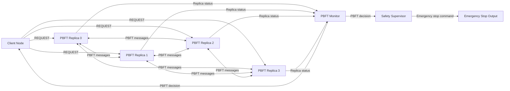

# ROS 2 PBFT Emergency Stop Simulator

ROS 2 simulator Practical Byzantine Fault Tolerance algoritma za donošenje distribuirane odluke o aktiviranju emergency stop funkcije.

Projekat prikazuje kako više ROS 2 čvorova može da postigne saglasnost o bezbednosnoj odluci čak i kada se deo čvorova ponaša neispravno ili zlonamerno. Pored osnovnog PBFT toka, implementirani su različiti vizantijski scenariji, promena primarne replike, automatsko testiranje, web konzola i merenje performansi sistema.

> Projekat je razvijen u edukativne svrhe kao predmetni projekat. Nije namenjen za direktnu primenu u realnom vozilu niti predstavlja safety-certified implementaciju.

---

## Cilj projekta

Cilj projekta je implementacija i analiza PBFT algoritma u ROS 2 okruženju na primeru distribuirane odluke o zaustavljanju vozila.

Sistem treba da omogući da grupa replika donese pouzdanu odluku čak i kada određeni broj replika:

* šalje neispravne poruke;
* šalje različite vrednosti drugim replikama;
* kasni sa slanjem poruka;
* preskače određene faze protokola;
* šalje duplirane poruke;
* koristi neispravan view ili sequence number;
* prestane da odgovara;
* predstavlja neispravnu primarnu repliku.

---

## Osnovne funkcionalnosti

Projekat obuhvata:

* normalan PBFT tok:

  * `REQUEST`;
  * `PRE-PREPARE`;
  * `PREPARE`;
  * `COMMIT`;
* konfigurabilan broj replika;
* podršku za najviše `f` vizantijskih replika;
* proveru PBFT uslova `n >= 3f + 1`;
* detekciju dupliranih poruka;
* proveru digest vrednosti zahteva;
* proveru identiteta pošiljaoca;
* baferovanje prerano pristiglih poruka;
* automatsku promenu view-a;
* izbor nove primarne replike;
* `VIEW-CHANGE` i `NEW-VIEW` poruke;
* prenos pripremljenog zahteva u novi view;
* simulaciju različitih vizantijskih ponašanja;
* safety supervisor sa fail-safe ponašanjem;
* automatsko izvršavanje test scenarija;
* web konzolu za konfiguraciju i testiranje;
* merenje latencije i broja protokolskih poruka.

---

## PBFT konfiguracija

Za sistem sa `n` replika i najviše `f` vizantijskih replika važi:

```text
n >= 3f + 1
```

Podrazumevana konfiguracija projekta je:

```text
n = 4
f = 1
```

To znači da sistem može da toleriše jednu neispravnu ili vizantijsku repliku.

Korišćeni pragovi su:

| Faza        |                 Potreban broj poruka |
| ----------- | -----------------------------------: |
| PREPARED    |    `2f` odgovarajućih PREPARE poruka |
| COMMITTED   | `2f + 1` odgovarajućih COMMIT poruka |
| VIEW-CHANGE | `2f + 1` validnih VIEW-CHANGE poruka |

Primarna replika se određuje na osnovu trenutnog view-a:

```text
primary_id = view mod replica_count
```

Za podrazumevanu konfiguraciju:

| View | Primarna replika |
| ---: | ---------------: |
|    0 |        Replica 0 |
|    1 |        Replica 1 |
|    2 |        Replica 2 |
|    3 |        Replica 3 |

---

## Arhitektura sistema



Sistem se sastoji od sledećih glavnih komponenti:

### Client node

Klijent kreira zahtev za aktiviranje emergency stop funkcije i objavljuje ga na ROS 2 temi.

Zahtev sadrži:

* jedinstveni identifikator zahteva;
* sequence number;
* trenutni view;
* vrednost `emergency_stop`;
* digest zahteva.

### PBFT replike

Svaka replika izvršava PBFT protokol i održava svoje lokalno stanje.

Replike:

* primaju klijentski zahtev;
* proveravaju ispravnost poruka;
* učestvuju u fazama PRE-PREPARE, PREPARE i COMMIT;
* prate broj primljenih poruka;
* odbacuju duplikate;
* aktiviraju view change kada nema napretka;
* objavljuju svoje trenutno stanje.

### PBFT monitor

Monitor pasivno prati stanje svih replika.

Njegova uloga je da:

* prikazuje napredovanje protokola;
* prikuplja stanja replika;
* proverava da li je dovoljan broj ispravnih replika doneo istu odluku;
* objavi konačnu odluku na temi `/pbft/decision`.

Monitor ne učestvuje u samom konsenzusu i ne šalje PREPARE ili COMMIT poruke.

### Safety supervisor

Safety supervisor predstavlja dodatni bezbednosni sloj između PBFT odluke i izlaza sistema.

Njegove glavne funkcije su:

* provera primljene odluke;
* provera broja potvrđujućih replika;
* provera digest vrednosti;
* aktiviranje fail-safe stanja kada odluka ne stigne na vreme;
* sprečavanje nebezbednog automatskog otpuštanja emergency stop komande.

Podrazumevano ponašanje sistema je bezbedno zaustavljanje:

```text
/vehicle/emergency_stop = true
```

---

## ROS 2 paketi

Repozitorijum sadrži dva ROS 2 paketa.

### `pbft_emergency_stop_interfaces`

Paket sadrži definicije prilagođenih ROS 2 poruka:

* `PBFTMessage.msg`;
* `ReplicaStatus.msg`;
* `PBFTDecision.msg`;
* `ViewChange.msg`;
* `NewView.msg`.

### `pbft_emergency_stop_simulator`

Paket sadrži:

* PBFT repliku;
* klijentski čvor;
* PBFT monitor;
* safety supervisor;
* scenario evaluator;
* performance monitor;
* launch fajlove;
* konfiguraciju scenarija;
* CLI alat za testiranje;
* web konzolu.

---

## Glavni ROS 2 čvorovi

| Čvor                  | Opis                                               |
| --------------------- | -------------------------------------------------- |
| `pbft_replica`        | Implementira ponašanje jedne PBFT replike          |
| `client_node`         | Kreira zahtev i čeka konačnu odluku                |
| `pbft_monitor`        | Prati stanja replika i formira potvrđenu odluku    |
| `safety_supervisor`   | Proverava odluku i upravlja emergency stop izlazom |
| `scenario_evaluator`  | Proverava da li je scenario prošao                 |
| `performance_monitor` | Prikuplja podatke o performansama                  |
| `pbft_test_cli`       | Pokreće scenarije iz terminala                     |
| `pbft_test_console`   | Pokreće web konzolu                                |

---

## Glavne ROS 2 teme

| Tema                      | Tip poruke        | Namena                           |
| ------------------------- | ----------------- | -------------------------------- |
| `/pbft/request`           | `PBFTMessage`     | Zahtev klijenta                  |
| `/pbft/pre_prepare`       | `PBFTMessage`     | Predlog primarne replike         |
| `/pbft/prepare`           | `PBFTMessage`     | PREPARE poruke                   |
| `/pbft/commit`            | `PBFTMessage`     | COMMIT poruke                    |
| `/pbft/view_change`       | `ViewChange`      | Zahtev za promenu view-a         |
| `/pbft/new_view`          | `NewView`         | Dokaz i aktiviranje novog view-a |
| `/pbft/status`            | `ReplicaStatus`   | Lokalno stanje replike           |
| `/pbft/decision`          | `PBFTDecision`    | Konačna potvrđena odluka         |
| `/vehicle/emergency_stop` | `std_msgs/Bool`   | Izlaz emergency stop sistema     |
| `/safety/state`           | `std_msgs/String` | Stanje safety supervisora        |

---

## Faze PBFT protokola

### 1. REQUEST

Klijent objavljuje zahtev za aktiviranje emergency stop funkcije.

### 2. PRE-PREPARE

Primarna replika proverava zahtev i prosleđuje PRE-PREPARE poruku backup replikama.

### 3. PREPARE

Backup replike proveravaju PRE-PREPARE poruku i objavljuju PREPARE poruke.

Replika prelazi u stanje `PREPARED` kada prikupi dovoljan broj odgovarajućih PREPARE poruka.

### 4. COMMIT

Nakon dostizanja PREPARED stanja replika objavljuje COMMIT poruku.

Replika prelazi u stanje `COMMITTED` kada prikupi najmanje `2f + 1` odgovarajućih COMMIT poruka.

### 5. Odluka

Monitor proverava da li je dovoljan broj replika dostigao isto COMMITTED stanje i zatim objavljuje konačnu odluku.

---

## View change

View change se koristi kada primarna replika ne omogućava napredovanje protokola.

Najčešći primer je scenario u kojem primarna replika:

* ne pošalje PRE-PREPARE poruku;
* postane nedostupna;
* šalje neispravne poruke;
* namerno blokira protokol.

Kada istekne progress timeout, ispravne replike objavljuju `VIEW-CHANGE` poruke.

Nova primarna replika čeka najmanje:

```text
2f + 1
```

validnih VIEW-CHANGE poruka, nakon čega formira i objavljuje `NEW-VIEW` poruku.

Ako postoji pripremljen zahtev iz prethodnog view-a, nova primarna replika ga prenosi u novi view i protokol se nastavlja bez gubitka prethodno postignutog napretka.

---

## Podržana vizantijska ponašanja

| Ponašanje          | Opis                                                    |
| ------------------ | ------------------------------------------------------- |
| `none`             | Replika se ponaša ispravno                              |
| `silent`           | Replika ne učestvuje u protokolu                        |
| `bad_digest`       | Replika šalje neispravan digest                         |
| `duplicate`        | Replika šalje duplirane poruke                          |
| `equivocation`     | Replika različitim primaocima šalje različite vrednosti |
| `skip_prepare`     | Replika preskače PREPARE fazu                           |
| `skip_commit`      | Replika preskače COMMIT fazu                            |
| `delayed_prepare`  | Replika kasni sa PREPARE porukom                        |
| `delayed_commit`   | Replika kasni sa COMMIT porukom                         |
| `early_commit`     | Replika šalje COMMIT pre dostizanja PREPARED stanja     |
| `wrong_sequence`   | Replika koristi neispravan sequence number              |
| `wrong_view`       | Replika koristi pogrešan view                           |
| `wrong_value`      | Replika šalje drugačiju emergency stop vrednost         |
| `invalid_sender`   | Poruka sadrži nevalidan identifikator pošiljaoca        |
| `skip_pre_prepare` | Neispravna primarna replika ne šalje PRE-PREPARE        |

---

## Implementirani scenariji

Projekat sadrži scenarije za proveru normalnog rada, vizantijskih ponašanja, kvoruma i promene primarne replike.

### Normalan rad

* normal consensus;
* normalan tok sa aktivnim progress timeout mehanizmom;
* potvrda odluke od dovoljnog broja replika.

### Neispravne poruke

* pogrešan digest;
* pogrešan sequence number;
* pogrešan view;
* pogrešna vrednost;
* nevalidan sender ID;
* duplirane poruke.

### Problemi sa redosledom poruka

* COMMIT poruka stiže pre PREPARED stanja;
* baferovanje ranih COMMIT poruka;
* zakašnjeni PREPARE;
* zakašnjeni COMMIT.

### Problemi sa kvorumom

* nedovoljan broj PREPARE poruka;
* nedovoljan broj COMMIT poruka;
* nedovoljan broj VIEW-CHANGE poruka;
* provera da duplirana poruka istog pošiljaoca ne povećava kvorum.

### View-change scenariji

* ručno pokretanje view change-a;
* automatski view change nakon isteka timeout-a;
* neispravna primarna replika;
* formiranje NEW-VIEW poruke;
* prenos prepared certificate-a;
* nastavak obrade zahteva u novom view-u;
* neispravna nova primarna replika.

Kompletan katalog scenarija nalazi se u fajlu:

```text
src/pbft_emergency_stop_simulator/config/scenario_catalog.yaml
```

---

## Zahtevi

Projekat je razvijen i testiran u sledećem okruženju:

* Ubuntu 24.04;
* ROS 2 Jazzy;
* Python 3;
* `colcon`;
* `rosdep`.

Za web konzolu potrebni su i sledeći Python paketi:

```bash
python3 -m pip install fastapi uvicorn pydantic PyYAML
```

---

## Preuzimanje projekta

Kreirati ROS 2 workspace i klonirati repozitorijum:

```bash
mkdir -p ~/pbft_ws/src
cd ~/pbft_ws/src

git clone https://github.com/Mackooo99/ros2-pbft-emergency-stop.git
```

Preći u workspace:

```bash
cd ~/pbft_ws
```

---

## Instalacija zavisnosti

Prvo učitati ROS 2 okruženje:

```bash
source /opt/ros/jazzy/setup.bash
```

Instalirati ROS 2 zavisnosti:

```bash
rosdep install --from-paths src --ignore-src -r -y
```

Instalirati Python zavisnosti za web konzolu:

```bash
python3 -m pip install fastapi uvicorn pydantic PyYAML
```

---

## Build projekta

Iz korena workspace-a pokrenuti:

```bash
cd ~/pbft_ws

source /opt/ros/jazzy/setup.bash

colcon build --symlink-install
```

Nakon uspešnog build-a učitati lokalni workspace:

```bash
source install/setup.bash
```

Ovu komandu je potrebno izvršiti u svakom novom terminalu.

---

## Pokretanje osnovnog scenarija

Za pokretanje sistema sa četiri ispravne replike:

```bash
ros2 launch pbft_emergency_stop_simulator \
  pbft_custom_demo.launch.py
```

Očekivano ponašanje:

1. klijent objavljuje emergency stop zahtev;
2. replika 0 je primarna replika;
3. replike prolaze kroz PRE-PREPARE, PREPARE i COMMIT faze;
4. najmanje tri replike donose istu odluku;
5. monitor objavljuje potvrđenu odluku;
6. safety supervisor aktivira potvrđeno emergency stop stanje.

---

## Pokretanje sistema sa vizantijskom replikom

Primer sa replikom 3 koja ne šalje poruke:

```bash
ros2 launch pbft_emergency_stop_simulator \
  pbft_custom_demo.launch.py \
  faulty_nodes:=3 \
  faulty_behaviors:=silent
```

Pošto sistem koristi četiri replike i toleriše jednu vizantijsku repliku, preostale tri ispravne replike treba uspešno da postignu konsenzus.

---

## Pokretanje view-change scenarija

Primer u kojem primarna replika ne šalje PRE-PREPARE poruku:

```bash
ros2 launch pbft_emergency_stop_simulator \
  pbft_custom_demo.launch.py \
  faulty_nodes:=0 \
  faulty_behaviors:=skip_pre_prepare \
  progress_timeout_nodes:=correct \
  progress_timeout_sec:=3.0
```

Očekivano ponašanje:

1. replika 0 ne šalje PRE-PREPARE;
2. ispravne replike detektuju da nema napretka;
3. replike objavljuju VIEW-CHANGE poruke;
4. replika 1 postaje nova primarna replika;
5. replika 1 objavljuje NEW-VIEW;
6. zahtev se obrađuje u view-u 1;
7. ispravne replike postižu konsenzus.

---

## Konfiguracija većeg sistema

Primer konfiguracije sa sedam replika i najviše dve vizantijske replike:

```bash
ros2 launch pbft_emergency_stop_simulator \
  pbft_custom_demo.launch.py \
  replica_count:=7 \
  max_faulty:=2 \
  faulty_nodes:=5,6 \
  faulty_behaviors:=silent,skip_commit
```

Za ovu konfiguraciju važi:

```text
n = 7
f = 2
```

---

## CLI testiranje

Jedan scenario se može pokrenuti komandom:

```bash
ros2 run pbft_emergency_stop_simulator \
  pbft_test_cli \
  --scenario normal_consensus
```

Pokretanje svih scenarija:

```bash
ros2 run pbft_emergency_stop_simulator \
  pbft_test_cli \
  --all
```

Pokretanje svih scenarija uz prekid nakon prve greške:

```bash
ros2 run pbft_emergency_stop_simulator \
  pbft_test_cli \
  --all \
  --stop-on-failure
```

Višestruko ponavljanje jednog scenarija:

```bash
ros2 run pbft_emergency_stop_simulator \
  pbft_test_cli \
  --scenario primary_timeout \
  --repeat 5
```

Izveštaji o izvršavanju se podrazumevano čuvaju u direktorijumu:

```text
~/.ros/pbft_test_console/runs
```

---

## Web test konzola

Web konzola omogućava:

* izbor broja replika;
* izbor maksimalnog broja vizantijskih replika;
* podešavanje timeout vrednosti;
* izbor neispravnih replika;
* izbor vizantijskih ponašanja;
* pokretanje pojedinačnih scenarija;
* pokretanje grupe scenarija;
* prikaz rezultata;
* generisanje HTML izveštaja.

Pokretanje web konzole:

```bash
ros2 run pbft_emergency_stop_simulator \
  pbft_test_console \
  --host 127.0.0.1 \
  --port 8080
```

Nakon toga otvoriti:

```text
http://127.0.0.1:8080
```

---

## Testiranje paketa

Pokretanje ROS 2 testova:

```bash
cd ~/pbft_ws

source /opt/ros/jazzy/setup.bash
source install/setup.bash

colcon test \
  --packages-select \
  pbft_emergency_stop_interfaces \
  pbft_emergency_stop_simulator
```

Prikaz rezultata:

```bash
colcon test-result --verbose
```

Za proveru kompletnog ponašanja sistema preporučuje se i izvršavanje svih integracionih scenarija:

```bash
ros2 run pbft_emergency_stop_simulator \
  pbft_test_cli \
  --all \
  --stop-on-failure
```

---

## Merenje performansi

Performance monitor meri:

* vreme od objavljivanja zahteva do odluke;
* trajanje view-change procesa;
* ukupan broj protokolskih poruka;
* view u kojem je odluka doneta;
* broj replika koje su potvrdile odluku;
* konačno stanje safety supervisora.

Pokretanje performance monitora:

```bash
ros2 launch pbft_emergency_stop_simulator \
  pbft_performance_monitor.launch.py \
  scenario_label:=manual
```

Rezultati se čuvaju u formatima:

* CSV;
* JSONL;
* Markdown.

Primer lokalno izmerenih rezultata za konfiguraciju `n = 4`, `f = 1`:

| Scenario         | Finalni view | Request-to-decision | View-change | Broj poruka |
| ---------------- | -----------: | ------------------: | ----------: | ----------: |
| Normal consensus |            0 |           33.649 ms |           — |          10 |
| Primary recovery |            1 |          385.287 ms |    8.605 ms |          14 |

Rezultati zavise od računara, ROS 2 konfiguracije i trenutnog opterećenja sistema. Ne predstavljaju hard real-time garanciju.

---

## Struktura repozitorijuma

```text
ros2-pbft-emergency-stop/
├── docs/
│   └── performance/
├── results/
│   └── performance/
├── src/
│   ├── pbft_emergency_stop_interfaces/
│   │   ├── msg/
│   │   ├── CMakeLists.txt
│   │   └── package.xml
│   │
│   └── pbft_emergency_stop_simulator/
│       ├── config/
│       ├── launch/
│       ├── pbft_emergency_stop_simulator/
│       │   ├── replica/
│       │   └── test_console/
│       ├── test/
│       ├── web/
│       ├── package.xml
│       └── setup.py
│
├── .gitignore
└── README.md
```

---

## Ograničenja

Trenutna implementacija ima sledeća ograničenja:

* sistem je simulator i nije namenjen direktnom upravljanju realnim vozilom;
* ROS 2 poruke nisu kriptografski potpisane;
* identitet pošiljaoca se proverava na nivou sadržaja poruke;
* digest omogućava proveru sadržaja, ali ne potvrđuje identitet pošiljaoca;
* monitor predstavlja pouzdanu komponentu simulacije;
* podržan je jedan aktivan klijentski zahtev u jednom trenutku;
* aplikaciono stanje je ograničeno na emergency stop odluku;
* trajno čuvanje stanja replika nije implementirano;
* oporavak nakon gašenja procesa nije implementiran;
* dinamičko dodavanje i uklanjanje replika nije podržano;
* mrežni problemi se simuliraju kašnjenjem i definisanim ponašanjem čvorova;
* sistem nije formalno verifikovan niti safety-certified.

---

## Moguća dalja unapređenja

Projekat se može proširiti sledećim funkcionalnostima:

* kriptografsko potpisivanje poruka;
* autentifikacija ROS 2 čvorova;
* DDS Security;
* podrška za više istovremenih zahteva;
* trajno čuvanje stanja replika;
* oporavak replike nakon restarta;
* checkpoint i garbage collection mehanizam;
* dinamička promena članstva;
* detaljnija simulacija mrežnih particija;
* promenljivo kašnjenje i gubitak poruka;
* integracija sa realnim vehicle interface slojem;
* formalna verifikacija sigurnosnih osobina;
* proširenje skupa unit i integration testova.

---

## Licenca

Projekat koristi Apache License 2.0.

Detalji licence treba da budu navedeni u root `LICENSE` fajlu repozitorijuma.
